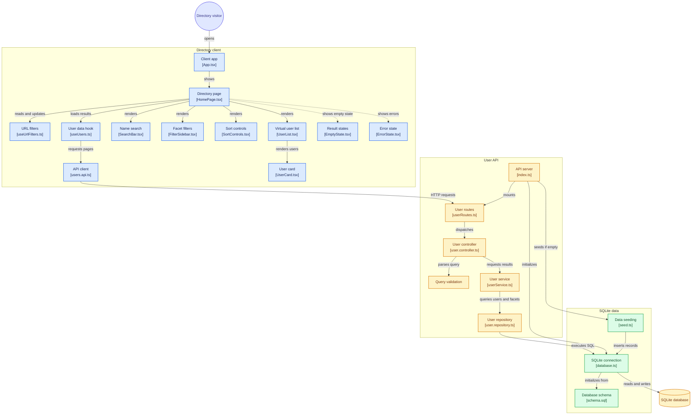

```mermaid
  flowchart TD

  subgraph group_client["Directory client"]
    node_app["Client app<br/>[App.tsx]"]
    node_home["Directory page<br/>[HomePage.tsx]"]
    node_urlstate["URL filters<br/>[useUrlFilters.ts]"]
    node_userhook["User data hook<br/>[useUsers.ts]"]
    node_api_client["API client<br/>[users.api.ts]"]
    node_search["Name search<br/>[SearchBar.tsx]"]
    node_filters["Facet filters<br/>[FilterSidebar.tsx]"]
    node_sorting["Sort controls<br/>[SortControls.tsx]"]
    node_userlist["Virtual user list<br/>[UserList.tsx]"]
    node_usercard["User card<br/>[UserCard.tsx]"]
    node_states["Result states<br/>[EmptyState.tsx]"]
    node_errorstate["Error state<br/>[ErrorState.tsx]"]
  end

  subgraph group_api["User API"]
    node_routes["User routes<br/>[userRoutes.ts]"]
    node_controller["User controller<br/>[user.controller.ts]"]
    node_validation["Query validation"]
    node_service["User service<br/>[userService.ts]"]
    node_repository["User repository<br/>[user.repository.ts]"]
    node_server["API server<br/>[index.ts]"]
  end

  subgraph group_data["SQLite data"]
    node_database["SQLite connection<br/>[database.ts]"]
    node_schema["Database schema<br/>[schema.sql]"]
    node_seed["Data seeding<br/>[seed.ts]"]
  end

  node_visitor(("Directory visitor"))
  node_sqlite[("SQLite database")]

  node_visitor -->|"opens"| node_app
  node_app -->|"shows"| node_home
  node_home -->|"reads and updates"| node_urlstate
  node_home -->|"loads results"| node_userhook
  node_home -->|"renders"| node_search
  node_home -->|"renders"| node_filters
  node_home -->|"renders"| node_sorting
  node_home -->|"renders"| node_userlist
  node_userlist -->|"renders users"| node_usercard
  node_home -.->|"shows empty state"| node_states
  node_home -.->|"shows errors"| node_errorstate
  node_userhook -->|"requests pages"| node_api_client
  node_api_client -->|"HTTP requests"| node_routes
  node_server -->|"mounts"| node_routes
  node_routes -->|"dispatches"| node_controller
  node_controller -->|"parses query"| node_validation
  node_controller -->|"requests results"| node_service
  node_service -->|"queries users and facets"| node_repository
  node_repository -->|"executes SQL"| node_database
  node_database -->|"reads and writes"| node_sqlite
  node_database -->|"initializes from"| node_schema
  node_server -->|"initializes"| node_database
  node_server -->|"seeds if empty"| node_seed
  node_seed -->|"inserts records"| node_database

  click node_app "https://github.com/abrar-292/presight-test/blob/main/client/src/App.tsx"
  click node_home "https://github.com/abrar-292/presight-test/blob/main/client/src/pages/HomePage.tsx"
  click node_urlstate "https://github.com/abrar-292/presight-test/blob/main/client/src/hooks/useUrlFilters.ts"
  click node_userhook "https://github.com/abrar-292/presight-test/blob/main/client/src/hooks/useUsers.ts"
  click node_api_client "https://github.com/abrar-292/presight-test/blob/main/client/src/api/users.api.ts"
  click node_search "https://github.com/abrar-292/presight-test/blob/main/client/src/components/SearchBar.tsx"
  click node_filters "https://github.com/abrar-292/presight-test/blob/main/client/src/components/FilterSidebar.tsx"
  click node_sorting "https://github.com/abrar-292/presight-test/blob/main/client/src/components/SortControls.tsx"
  click node_userlist "https://github.com/abrar-292/presight-test/blob/main/client/src/components/UserList.tsx"
  click node_usercard "https://github.com/abrar-292/presight-test/blob/main/client/src/components/UserCard.tsx"
  click node_states "https://github.com/abrar-292/presight-test/blob/main/client/src/components/EmptyState.tsx"
  click node_errorstate "https://github.com/abrar-292/presight-test/blob/main/client/src/components/ErrorState.tsx"
  click node_routes "https://github.com/abrar-292/presight-test/blob/main/server/src/routes/userRoutes.ts"
  click node_controller "https://github.com/abrar-292/presight-test/blob/main/server/src/controllers/user.controller.ts"
  click node_validation "https://github.com/abrar-292/presight-test/blob/main/server/src/validations/userQuery.validation.ts"
  click node_service "https://github.com/abrar-292/presight-test/blob/main/server/src/services/userService.ts"
  click node_repository "https://github.com/abrar-292/presight-test/blob/main/server/src/repositories/user.repository.ts"
  click node_server "https://github.com/abrar-292/presight-test/blob/main/server/src/index.ts"
  click node_database "https://github.com/abrar-292/presight-test/blob/main/server/src/db/database.ts"
  click node_schema "https://github.com/abrar-292/presight-test/blob/main/server/src/db/schema.sql"
  click node_seed "https://github.com/abrar-292/presight-test/blob/main/server/src/db/seed.ts"

  classDef toneNeutral fill:#f8fafc,stroke:#334155,stroke-width:1.5px,color:#0f172a
  classDef toneBlue fill:#dbeafe,stroke:#2563eb,stroke-width:1.5px,color:#172554
  classDef toneAmber fill:#fef3c7,stroke:#d97706,stroke-width:1.5px,color:#78350f
  classDef toneMint fill:#dcfce7,stroke:#16a34a,stroke-width:1.5px,color:#14532d
  classDef toneRose fill:#ffe4e6,stroke:#e11d48,stroke-width:1.5px,color:#881337
  classDef toneIndigo fill:#e0e7ff,stroke:#4f46e5,stroke-width:1.5px,color:#312e81
  classDef toneTeal fill:#ccfbf1,stroke:#0f766e,stroke-width:1.5px,color:#134e4a
  class node_app,node_home,node_urlstate,node_userhook,node_api_client,node_search,node_filters,node_sorting,node_userlist,node_usercard,node_states,node_errorstate toneBlue
  class node_routes,node_controller,node_validation,node_service,node_repository,node_server,node_sqlite toneAmber
  class node_database,node_schema,node_seed toneMint
  class node_visitor toneIndigo
```
